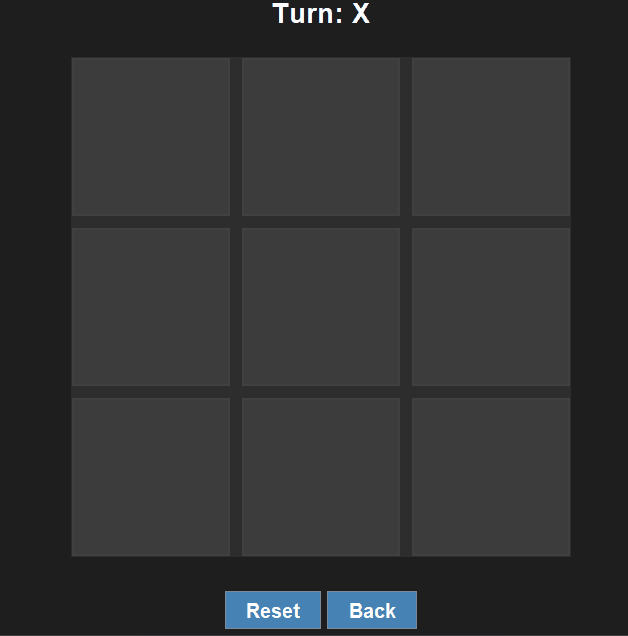

# Java Tic-Tac-Toe
A desktop-based Tic-Tac-Toe application built using **Java Swing**, featuring both single-player and local multiplayer modes.

## Features
* **Dynamic GUI:** Built with `JFrame` and `JPanel` for a responsive graphical interface.
* **Multiple Game Modes:** Support for 1-Player (vs. CPU) and 2-Player local modes.
* **Intuitive Navigation:** Includes a main menu, rules page, and mid-game controls (Reset/Back).
* **Game Logic:** Automated win/draw detection and a turn indicator.
* **State Management:** Uses `CardLayout` for seamless screen transitions.

## Tech Stack
* **Language:** Java
* **Framework:** Java Swing (GUI)
* **Architecture:** Event-Driven Programming

## Core Competencies
* **Event Handling:** Implemented `ActionListener` for 3x3 grid interactions and menu navigation.
* **UI/UX Design:** Utilized layout managers to maintain component alignment and visual hierarchy.
* **Game State Logic:** Managed player turns, symbol toggling, and win-condition algorithms.
* **AI Implementation:** Developed basic logic for computer-opponent decision-making.
